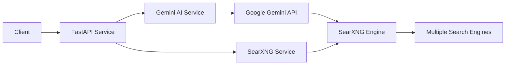

# MetaCrawler AI Research

**MetaCrawler** là một dịch vụ nghiên cứu thông minh kết hợp sức mạnh của Google Gemini AI và công cụ tìm kiếm meta SearXNG. Hệ thống tự động phân tích chủ đề, tạo bản tóm tắt chi tiết và tìm kiếm thông tin liên quan trên web một cách hiệu quả.

## 🌟 Tính năng

- **Phân tích thông minh với Gemini AI**: Tự động sinh mô tả chi tiết, điểm chính (key points) và truy vấn tìm kiếm tối ưu
- **Tìm kiếm meta với SearXNG**: Tìm kiếm trên nhiều nguồn web đồng thời mà không bị theo dõi
- **Hỗ trợ đa loại đối tượng**: Nhân vật (person), sự kiện (event), hoặc chủ đề (topic)
- **Đa ngôn ngữ**: Hỗ trợ tiếng Việt, tiếng Anh và nhiều ngôn ngữ khác
- **RESTful API**: FastAPI với OpenAPI documentation tích hợp sẵn
- **Docker ready**: Dễ dàng triển khai với Docker Compose

## 🏗️ Kiến trúc



## 🛠️ Tech Stack

- **Backend Framework**: FastAPI 0.115.0
- **AI Service**: Google Generative AI (Gemini 2.5 Flash Lite)
- **Search Engine**: SearXNG (self-hosted meta search)
- **Language**: Python 3.12
- **Container**: Docker & Docker Compose
- **Validation**: Pydantic 2.9.2

## 📋 Yêu cầu hệ thống

- Python 3.12 hoặc cao hơn
- Docker & Docker Compose (nếu chạy bằng container)
- Google Gemini API key (đăng ký miễn phí tại [Google AI Studio](https://makersuite.google.com/app/apikey))

## 🚀 Cài đặt

### Phương pháp 1: Chạy với Docker Compose (Khuyến nghị)

1. **Clone repository**:
```bash
git clone <repository-url>
cd MetaCrawler
```

2. **Cấu hình environment variables**:
```bash
cd app
cp ".env example" .env
```

3. **Chỉnh sửa file `.env`** với thông tin của bạn:
```env
# Gemini API Configuration
GEMINI_API_KEY=your_gemini_api_key_here
GEMINI_MODEL=gemini-2.5-flash-lite

# SearXNG Configuration
SEARXNG_BASE_URL=http://searxng:8080
SEARXNG_DEFAULT_LANGUAGE=vi
SEARXNG_DEFAULT_CATEGORIES=news
SEARXNG_TIMEOUT=20
SEARCH_QUERY_MAX_LEN=260
```

> ⚠️ **Lưu ý**: Khi chạy với Docker Compose, `SEARXNG_BASE_URL` phải là `http://searxng:8080` (service name trong docker-compose.yml)

4. **Khởi động services**:
```bash
docker-compose up -d
```

5. **Kiểm tra trạng thái**:
```bash
docker-compose ps
```

Services sẽ chạy tại:
- **MetaCrawler API**: http://localhost:8010
- **SearXNG**: http://localhost:9090
- **API Documentation**: http://localhost:8010/docs

### Phương pháp 2: Chạy local (Development)

1. **Clone repository và cấu hình**:
```bash
git clone <repository-url>
cd MetaCrawler/app
```

2. **Tạo virtual environment**:
```bash
python -m venv .venv
.venv\Scripts\activate  # Windows
# source .venv/bin/activate  # Linux/Mac
```

3. **Cài đặt dependencies**:
```bash
pip install -r requirements.txt
```

4. **Cấu hình environment**:
```bash
cp ".env example" .env
```

Chỉnh sửa `.env`:
```env
GEMINI_API_KEY=your_gemini_api_key_here
GEMINI_MODEL=gemini-2.5-flash-lite
SEARXNG_BASE_URL=http://localhost:9090
SEARXNG_DEFAULT_LANGUAGE=vi
SEARXNG_DEFAULT_CATEGORIES=news
SEARXNG_TIMEOUT=20
SEARCH_QUERY_MAX_LEN=260
```

5. **Khởi động SearXNG** (cần Docker):
```bash
docker-compose up -d searxng
```

6. **Chạy FastAPI server**:
```bash
uvicorn main:app --host 0.0.0.0 --port 8000 --reload
```

API sẽ chạy tại: http://localhost:8000

## 📖 Sử dụng

### Health Check

```bash
curl http://localhost:8010/health
```

Response:
```json
{
  "status": "ok"
}
```

### Research API

**Endpoint**: `POST /api/research`

**Request Body**:
```json
{
  "name": "Văn Toàn",
  "object_type": "person",
  "short_description": "Cầu thủ bóng đá Việt Nam",
  "language": "vi",
  "max_results": 10
}
```

**Parameters**:
- `name` (string, required): Tên nhân vật/sự kiện/chủ đề cần nghiên cứu
- `object_type` (string, optional): Loại đối tượng - `person`, `event`, hoặc `topic` (mặc định: `topic`)
- `short_description` (string, optional): Mô tả ngắn làm ngữ cảnh cho AI
- `language` (string, optional): Mã ngôn ngữ (ví dụ: `vi`, `en`) - mặc định: `vi`
- `max_results` (integer, optional): Số kết quả tìm kiếm tối đa (1-50) - mặc định: `10`

**Response**:
```json
{
  "name": "Văn Toàn",
  "object_type": "person",
  "short_description": "Cầu thủ bóng đá Việt Nam",
  "description": "Văn Toàn là một cầu thủ bóng đá nổi tiếng của Việt Nam...",
  "key_points": [
    "Tiền đạo của đội tuyển quốc gia Việt Nam",
    "Từng thi đấu cho CLB Hoàng Anh Gia Lai",
    "Ghi nhiều bàn thắng quan trọng cho ĐTQG",
    "Được biết đến với kỹ thuật cá nhân tốt"
  ],
  "search_query": "Văn Toàn cầu thủ bóng đá Việt Nam tiểu sử sự nghiệp",
  "search_results": [
    {
      "title": "Nguyễn Văn Toàn - Wikipedia tiếng Việt",
      "url": "https://vi.wikipedia.org/wiki/Nguyễn_Văn_Toàn",
      "description": "Nguyễn Văn Toàn sinh năm 1993...",
      "published_date": "2024-01-15"
    }
  ],
  "crawler_payload": ["..."]
}
```

### Ví dụ với cURL

```bash
curl -X POST "http://localhost:8010/api/research" \
  -H "Content-Type: application/json" \
  -d '{
    "name": "Chiến tranh Việt Nam",
    "object_type": "event",
    "short_description": "Cuộc chiến tranh diễn ra từ 1955-1975",
    "language": "vi",
    "max_results": 15
  }'
```

### Ví dụ với Python

```python
import requests

url = "http://localhost:8010/api/research"
payload = {
    "name": "Trí tuệ nhân tạo",
    "object_type": "topic",
    "short_description": "Machine Learning và Deep Learning",
    "language": "vi",
    "max_results": 20
}

response = requests.post(url, json=payload)
data = response.json()

print(f"Description: {data['description']}")
print(f"Key Points: {data['key_points']}")
print(f"Search Results: {len(data['search_results'])} results found")
```

## 🔧 Cấu hình

### Environment Variables

| Variable | Mô tả | Mặc định | Bắt buộc |
|----------|-------|----------|----------|
| `GEMINI_API_KEY` | API key của Google Gemini | - | ✅ |
| `GEMINI_MODEL` | Tên model Gemini sử dụng | `gemini-2.5-flash-lite` | ❌ |
| `SEARXNG_BASE_URL` | URL của SearXNG service | `http://localhost:9090` | ❌ |
| `SEARXNG_DEFAULT_LANGUAGE` | Ngôn ngữ mặc định cho tìm kiếm | `vi` | ❌ |
| `SEARXNG_DEFAULT_CATEGORIES` | Danh mục tìm kiếm mặc định | `news` | ❌ |
| `SEARXNG_TIMEOUT` | Timeout khi gọi SearXNG (giây) | `20` | ❌ |
| `SEARCH_QUERY_MAX_LEN` | Độ dài tối đa của search query | `260` | ❌ |

### SearXNG Configuration

File cấu hình SearXNG nằm tại `app/searxng/settings.yml`. Bạn có thể tùy chỉnh:
- Các search engines được sử dụng
- Ngôn ngữ và khu vực
- Độ ưu tiên của từng engine
- Cài đặt privacy và bảo mật

## 📁 Cấu trúc dự án

```
MetaCrawler/
├── app/
│   ├── services/
│   │   ├── __init__.py
│   │   ├── ai_service.py          # Service tích hợp Gemini AI
│   │   └── searxng_service.py     # Service tích hợp SearXNG
│   ├── searxng/
│   │   └── settings.yml           # Cấu hình SearXNG
│   ├── main.py                    # FastAPI application
│   ├── schemas.py                 # Pydantic models
│   ├── config.py                  # Configuration (legacy)
│   ├── requirements.txt           # Python dependencies
│   ├── Dockerfile                 # Docker image cho API
│   ├── docker-compose.yml         # Docker Compose configuration
│   ├── .env                       # Environment variables (không commit)
│   └── .env example               # Environment template
├── .gitignore
└── README.md
```

## 🔍 API Documentation

Sau khi khởi động service, truy cập:

- **Swagger UI**: http://localhost:8010/docs
- **ReDoc**: http://localhost:8010/redoc
- **OpenAPI Schema**: http://localhost:8010/openapi.json

## 🐛 Debugging & Logging

Ứng dụng sử dụng Python logging module với format:
```
%(asctime)s | %(levelname)s | %(name)s | %(message)s
```

**Xem logs với Docker Compose**:
```bash
# Tất cả services
docker-compose logs -f

# Chỉ API service
docker-compose logs -f ai_research

# Chỉ SearXNG service
docker-compose logs -f searxng
```

**Log levels**:
- `INFO`: Thông tin chung về request/response
- `WARNING`: Cảnh báo khi fallback hoặc dữ liệu không đầy đủ
- `ERROR`: Lỗi trong quá trình xử lý

## 🔒 Bảo mật

> ⚠️ **Quan trọng**: 
> - **KHÔNG** commit file `.env` chứa API key lên Git
> - Trong production, hạn chế `allow_origins` trong CORS middleware
> - Sử dụng HTTPS khi deploy public
> - Thay đổi `SEARXNG_SECRET` trong docker-compose.yml

## 🚢 Triển khai Production

### Checklist

- [ ] Thay đổi `SEARXNG_SECRET` trong docker-compose.yml
- [ ] Cấu hình CORS origins cụ thể thay vì `["*"]`
- [ ] Sử dụng reverse proxy (Nginx/Traefik) với SSL
- [ ] Thiết lập rate limiting
- [ ] Cấu hình monitoring và alerting
- [ ] Backup cấu hình và logs định kỳ
- [ ] Sử dụng secrets management (không hard-code API keys)

## 🤝 Đóng góp

Contributions, issues và feature requests đều được chào đón!

## 📝 License

[Thêm license của bạn ở đây]

## 👤 Tác giả

- Huy

## 🙏 Credits

- [FastAPI](https://fastapi.tiangolo.com/) - Modern web framework
- [Google Gemini](https://ai.google.dev/) - AI model
- [SearXNG](https://github.com/searxng/searxng) - Privacy-respecting metasearch engine

---

**Happy Researching! 🚀**
